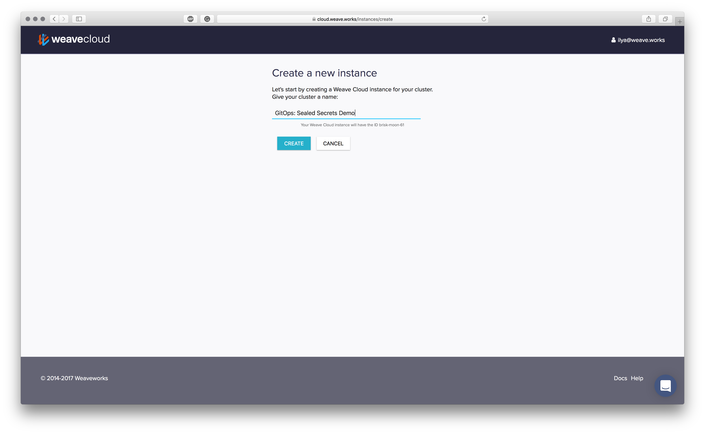
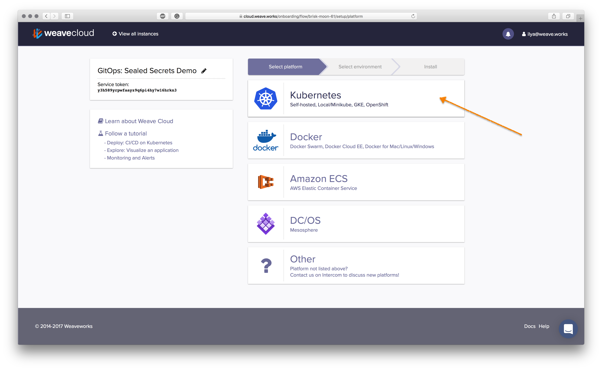
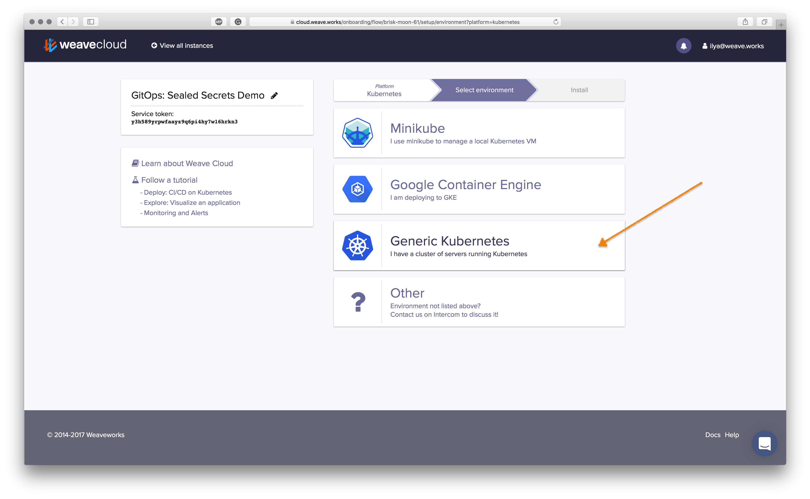
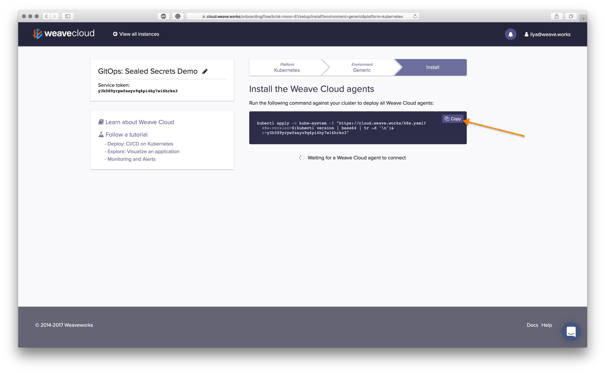
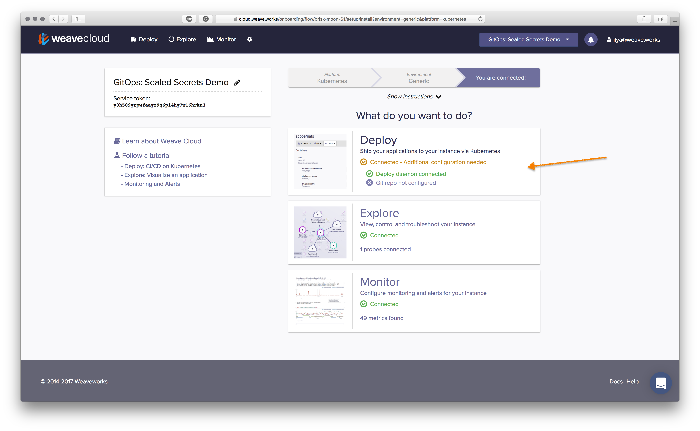
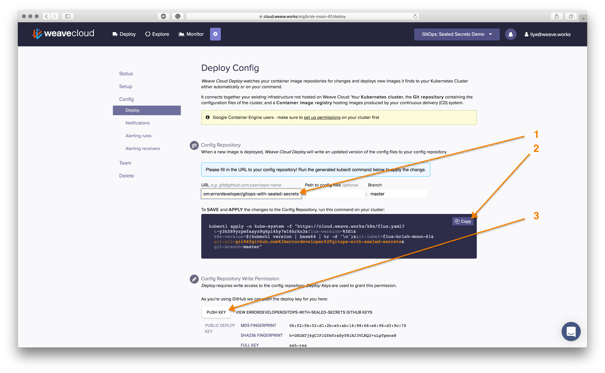
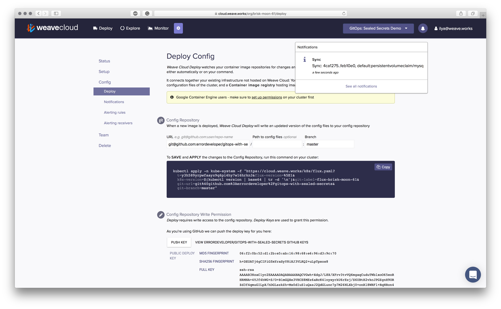
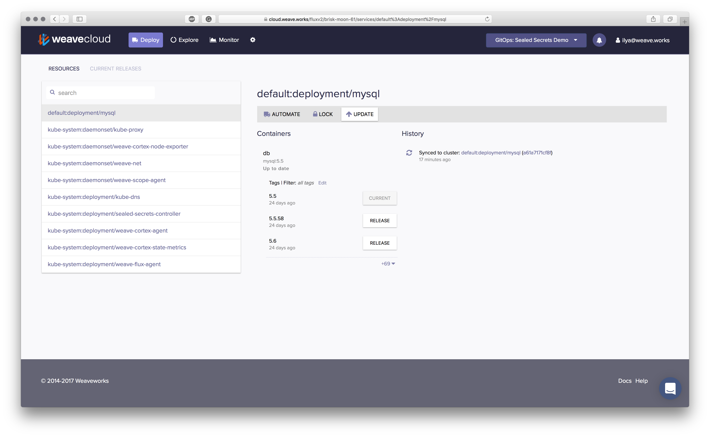

[Recently](https://www.weave.works/blog/gitops-operations-by-pull-request), the fine folks at Weaveworks have been advocating for a mode of operation they call _GitOps_.

This resonates true with our SRE team at Bitnami where we use Kubernetes to manage [Bitnami Cloud Hosting](https://bitnami.com/cloud) - a launchpad for over 100 applications on public Clouds.

Our internal deployment pipeline relies on Git as the source of truth. This is where we declare the state of our applications. A Jenkins based setup takes this declared state and applies it to our Kubernetes clusters. This homegrown pipeline that we have at Bitnami very closely resembles what Weaveworks described in their latest [GitOps blog](https://www.weave.works/blog/the-gitops-pipeline).

Like Weaveworks, we believe that _GitOps_ is the future (and for some already the present) of application management.

One of our open source projects is specifically addressing a GitOps workflow. [Sealed-secrets](https://github.com/bitnami/sealed-secrets) is a Kubernetes Custom Resource Definition Controller which allows you to store even sensitive information (aka secrets) in Git. Indeed what Sealed-secrets is solving is the following problem: _"I can manage all of my Kubernetes configs in git, except Secrets."_

In this blog we show you how Weave Cloud Deploy can be used in conjunction with Bitnami's [Sealed-secrets](https://github.com/bitnami/sealed-secrets) to create a continuous deployment pipeline where all operations are git based and where the desired state of your apps is declared in your git repos including your secrets.

## Setup Weave Cloud Deploy

Start by creating a Weave Cloud account at https://cloud.weave.works, and create an instance as show in screenshot below (name it whatever you like, of course):




Then follow the setup instruction to install agents in your Kubernetes cluster, and copy `kubectl apply` command from Weave Cloud setup page.





Next, run `kubectl apply` command you've copied to install the Weave Cloud agents.

Now, **fork this repository**, copy SSH URL (`git@github:<username>/gitops-with-sealed-secrets`) and proceed to deploy configuration page in Weave Cloud as show in screenshot below.



Enter the repository URL and copy `kubectl apply` command to update agent's configuration, then click 'push key' button to complete repository setup.



Once the agent is connected and configured correctly, you should see 'Sync' notification as show on screenshot below.



You should also be able to find `default:deployment/mysql` in Weave Cloud Deploy UI.




Now in your Git repo, you can add all the YAML manifests that make up your application. GitOps will be in effect and every git push resulting in a commit will result in the Weave Cloud agent pulling the new version of the manifests and applying the difference in your Kubernetes cluster.

The role of Sealed-secrets is to be able to store sensitive secrets -like passwords- as encrypted Kubernetes objects and benefit from Weave Cloud at the same time. If we were to use the default Secret object from Kubernetes those would not be encrypted (they are only BASE64-encoded).

Sealed-secrets are custom objects implemented thanks to a Custom Resource Definition and a controller running in your cluster

To tie Weave Cloud Deploy and Sealed-secrets together you simply need to deploy Sealed-secrets in your cluster as well.

## [Sealed-secrets](https://github.com/bitnami/sealed-secrets)

To install Sealed-secrets in your Kubernetes cluster you need to do the following: First determine the latest stable release, then download the client for secret encryption `kubeseal` , create the CRD object and finally launch the controller. This is typical process for a CRD based controller.

```
release=$(curl --silent "https://api.github.com/repos/bitnami/sealed-secrets/releases/latest" | sed -n 's/.*"tag_name": *"\([^"]*\)".*/\1/p')

# Install client-side tool into /usr/local/bin/
GOOS=$(go env GOOS)
GOARCH=$(go env GOARCH)
wget https://github.com/bitnami/sealed-secrets/releases/download/$release/kubeseal-$GOOS-$GOARCH
sudo install -m 755 kubeseal-$GOOS-$GOARCH /usr/local/bin/kubeseal

# Install SealedSecret CRD (for k8s >= 1.7)
kubectl create -f https://github.com/bitnami/sealed-secrets/releases/download/$release/sealedsecret-crd.yaml

# Install server-side controller into kube-system namespace (by default)
kubectl create -f https://github.com/bitnami/sealed-secrets/releases/download/$release/controller.yaml
```

Now, clone your fork of this repository and cd into it.
```
git clone git@github.com/<username>/gitops-with-sealed-secrets
cd gitops-with-sealed-secret
```

To generate a SealedSecret object you need to create a regular Kubernetes secret object localy and then use `kubeseal` to obtain a properly encrypted secret:

```
kubectl create secret generic mysql --from-literal=password=root -o json --dry-run > secret.json
```

The contents of resulting `secret.json` will apper like this:
```
{
    "kind": "Secret",
    "apiVersion": "v1",
    "metadata": {
        "name": "mysql",
        "creationTimestamp": null
    },
    "data": {
        "password": "cm9vdA=="
    }
}
```

Save it in a file and encrypt it using `kubeseal` command like this:

> Note: currently Weave Cloud Deploy doesn't support JSON, but as YAML is a subset of JSON we can simply use `.yaml` suffix

```
kubeseal < secret.json > sealed-secret.yaml
```

And check it in:

```
git add sealed-secret.yaml
git commit -m 'Add sealed secrtet'
git push
```

Now this encrypted secret can be stored in Git as you wish, and once the Weave Cloud agent deploys it automatically, the Sealed-secrets controller will detect it and automatically decrypt it and generate a real Kubernetes secret object.

This process allows you to keep using GitOps even for your sensitive information. You keep it fully encrypted in your git repo but the Weave Cloud agent will automatically leverage the sealed secret controller to generate the valid secret object that your other manifests can use.


## [Example](https://github.com/sebgoa/flux-demo) with MySQL Database

> Note: This example is aleready include in the repository

To illustrate all of this, write a manifest to run MySQL database using a `mysql` secret that holds the MySQL root password:

```
apiVersion: apps/v1beta2
kind: Deployment
metadata:
  name: mysql
  labels:
    name: mysql
spec:
  selector:
    matchLabels:
      name: mysql
  template:
    metadata:
      labels:
        name: mysql
    spec:
      containers:
      - image: mysql:5.5
        name: db
        volumeMounts:
        - mountPath: /var/lib/mysql
          name: barfoo
        env:
          - name: MYSQL_ROOT_PASSWORD
            valueFrom:
              secretKeyRef:
                name: mysql
                key: password
      volumes:
      - name: barfoo
        persistentVolumeClaim:
          claimName: mysql
```

But instead of storing an unencrypted secret you store in Git a _Sealed-Secret_ which is safe to share publicly.

```
apiVersion: bitnami.com/v1alpha1
kind: SealedSecret
metadata:
  creationTimestamp: null
  name: mysql
  namespace: default
spec:
  data: AgAIrZ8LY52S5kBm7FTrL8Zo4cDDDdMzfoIoEiuYd2o3RGbHEqi9cEYgQqncyFHHXvb7NIjQ97aNkPt9N0D/0IlDF43ZF9l7OUU5aUPoNgpuNYf8cqgor5HM6rt6tHdkrRYcXJPvTUktorY7g9KOuwu7JimK0qVU/NhViZlgUvDhxIDnkwpcfj8TbXNXwBXrXi94IvbCuxeHpqi2z7xDJXVmo9ZAbLSboQooO7+MA56ZcqpkrKv0VflYEAEO2V+NpJYS3CNZh4t4wM/HAlMkW7TXnsBk325cahB5+h46uZs1Tlndjx/cIwvF9WIv0XT5EdMVkgYD2Br3vYHKgRK9Hn6qF0HnB6Xma/Ie27iyNE50uzG9QMX6X4p7NWRlKFHevQYYCsxxVoIdNYD3c4hpg7d72zkZ2hT18bqWZh5ApJTQcAhrpxUsrB0RorFn8yomcQsooVXJtZrFQDNcJopIu/J6oGYPJ/ABvk3uzjm8IfHYrHzr1qedrjErenp18qaL6SrvEc0aGQPAyseGMtka4O4ufvGHLUUx+/W/j63yAEr0Xdm+9dTcoX9cie5rbPq90zdaLSNoCRvhqcL5S5SisOZ/AM1832wZ/6jVdkBWram4B+ZfeRgMvQ4xGkKUlJpoZYTgSik9cRdH5Hmld1OQeoM4nQCUabucoG7djOQK6TY1JWzX2BhNATRPPoEYNojhk1hNSkRsjplhCTr7Xa87yf5RZ3NFHeMFNsDV8EOY8gpHmlREd5MR7jFfss7/B+KLLW+XEgKBJILJAIQbJrR3bqI/WOfdsxLT7SMGfRjLBmehiuzFsekePL+zX0jURrro3AkZqsKCcHtjFemMdyDXO4dBgkT/eRyGVh9+dnPio9tnkRRCHOlb1MY6k/jTlvog
```

If you are curious to learn more about the encryption process please check the [details](https://github.com/bitnami/sealed-secrets#details) or a more detailed [blog](https://engineering.bitnami.com/articles/sealed-secrets.html).

The result is that in your cluster you will see a running mysql Pod that is using a Kubernetes Secret to store its root password. However the actual password is stored safely in Git as a sealed secret.

```
$ kubectl get deployments,pods,secrets
NAME           DESIRED   CURRENT   UP-TO-DATE   AVAILABLE   AGE
deploy/mysql   1         1         1            0           14m

NAME                        READY     STATUS  RESTARTS   AGE
po/mysql-6965c5b477-wqtw8   1/1       Ready   0          14m

NAME                          TYPE                                  DATA      AGE
secrets/default-token-rndqq   kubernetes.io/service-account-token   3         12d
secrets/mysql                 Opaque
```
